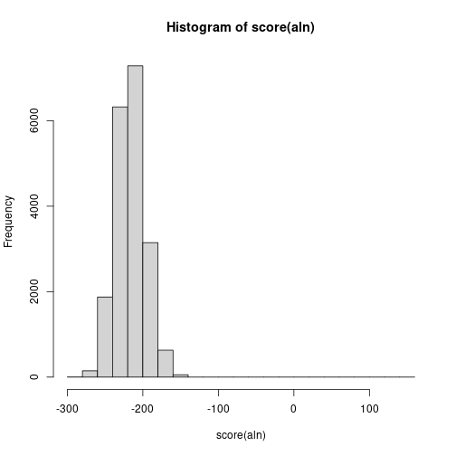
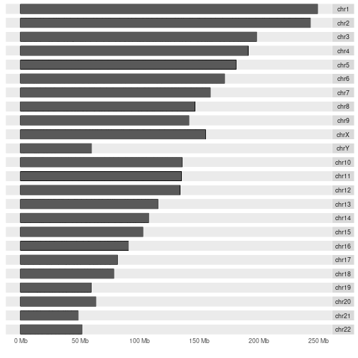
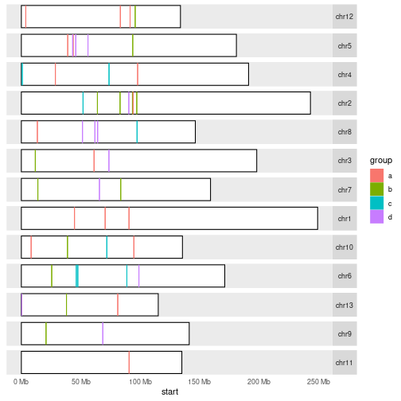

## Bioconductor

Bioconductor  is an open source, open development software project to provide 
tools for the analysis and comprehension of high-throughput genomic data.
Bioconductor is similar to CRAN as an interface to access R packages, but 
contains packages that are more biology oriented and 
curated by the team of experts. 

As bioinformaticians you will most likely operate within Bioconductor 
universe. It is designed with exchangability in mind, many packages work 
together and creation of powerfull pipelines becomes possible.

To install Bioconductor visit [this](http://bioconductor.org/install/) page or do:

~~~
source("https://bioconductor.org/biocLite.R")
biocLite()
~~~
{: .r}

Lets install packages that will be usefull in this lesson.

~~~
biocLite(c("IRanges", "GenomicRanges", "ShortRead", "Biostrings", "ggbio"))
~~~
{: .r}

Take a look how Bioconductor core packages are structured below. We will go through some of these 
packages. If you open any of these packages in the Bioconductor website, you can find there 
vignettes explaining in detail how to use them.

<pre style = "background-color: white; border: none; font-family: monospace, monospace;">
                   VariantAnnotation                Annotate variants, predict coding outcomes.
                           |
                           v
                    GenomicFeatures                 Making and manipulating annotations.
                           |
                           v
                       BSgenome                     Representation of full genomes and their SNPs.
                           |
                           v
                      rtracklayer                   Manipulating annotation tracks eg.BED, GFF, BigWig.
                           |
                           v
                    GenomicAlignments               Manipulation of short genomic alignments.
                      |           |
                      v           v
     SummarizedExperiment   Rsamtools  ShortRead    Load, contain and manipulate different data types.
                  |         |      |      |
                  v         v      v      v
                GenomicRanges     Biostrings        Lower level representations of short sequences.
                        |          |
                        v          v
               GenomeInfoDb   (XVector)             Utilities for genomic coordinates.
                        |     |
                        v     v
                        IRanges                     Representation of ranged data.
                           |
                           v 
                      (S4Vectors)                   S4 implementation of vectors and lists.
</pre>

## IRanges

[IRanges](http://bioconductor.org/packages/release/bioc/html/IRanges.html) package 
 designed to represent sequences, ranges representing indices along those sequences,
and data related to those ranges. IRanges are very fast and provide multiple usefull 
function to operate on them.

~~~
library(IRanges)
ir <- IRanges(c(1, 5, 14, 15, 19, 34, 40), width = c(12, 6, 6, 15, 6, 2, 7))
ir
~~~
{: .r}

~~~
IRanges object with 7 ranges and 0 metadata columns:
          start       end     width
      <integer> <integer> <integer>
  [1]         1        12        12
  [2]         5        10         6
  [3]        14        19         6
  [4]        15        29        15
  [5]        19        24         6
  [6]        34        35         2
  [7]        40        46         7
~~~
{: .output}

Lets use function below to plot our ranges. Notice widths, are they what you would expect?

~~~
plotRanges <- function(x) {
  height <- 1
  sep <- 0.5
  xlim <- c(min(start(x)), max(end(x)))
  bins <- disjointBins(IRanges(start(x), end(x) + 1))
  plot.new()
  plot.window(xlim, c(0, max(bins)*(height + sep)))
  ybottom <- bins * (sep + height) - height
  rect(start(x) - 0.5, ybottom, end(x) + 0.5, ybottom + height)
  axis(1)
}
plotRanges(ir)
~~~
{: .r}

> ## Challenge 1
>
> Create same plot as in plotRanges, but using ggplot2. How similar looking plot you can make?
>
> Hint: Use `geom_rect`.
>
> > ## Solution to challenge 1
> > 
> > ~~~
> > plotRanges_gg <- function(x) {
> >   bins <- disjointBins(IRanges(start(ir), end(ir) + 1))
> >   dat <- cbind(as.data.frame(ir), bin = bins)
> >   ggplot2::ggplot(dat) + 
> >     ggplot2::geom_rect(ggplot2::aes(xmin = start - 0.5, xmax = end + 0.5,
> >                        ymin = bin, ymax = bin + 0.9), fill = "#FFFFFF", colour = "black") +
> >     ggplot2::theme_bw() +
> >     ggplot2::theme(axis.title.y = ggplot2::element_blank(),
> >                    axis.text.y = ggplot2::element_blank(),
> >                    axis.ticks.y = ggplot2::element_blank(),
> >                    panel.grid.major = ggplot2::element_blank(),
> >                    panel.grid.minor = ggplot2::element_blank(),
> >                    panel.border = ggplot2::element_blank(),
> >                    axis.line.x = ggplot2::element_line(colour = "black"))
> > }
> > plotRanges_gg(ir)
> > ~~~
> > {: .r}
> > 
> > 
> {: .solution}
{: .challenge}

You can subset IRanges like any other vector.

~~~
ir <- ir[2]
ir
~~~
{: .r}

~~~
IRanges object with 1 range and 0 metadata columns:
          start       end     width
      <integer> <integer> <integer>
  [1]         5        10         6
~~~
{: .output}

Here are some operations performed on IRanges. Try them out.

## GenomicRanges

The goal of [GenomicRanges](http://bioconductor.org/packages/release/bioc/html/GenomicRanges.html) is to provide general containers for genomic data. The central class, at least from the user
perspective, is GRanges, which formalizes the notion of ranges, while allowing for arbitrary “metadata columns” to be
attached to it. These columns offer the same flexibility as the venerable data.frame and permit users to adapt GRanges
to a wide variety of adhoc use-cases. To represent genomic location we need to have information about strand and chromosome names, 
here called `seqnames`. 

Lets construct our first `GRanges` object containing 10 genomic ranges.

~~~
library(GenomicRanges)

gr <- GRanges(
  seqnames = Rle(c("chr1", "chr2", "chr1", "chr3"), c(1, 3, 2, 4)),
  ranges = IRanges(101:110, end = 111:120, 
  names = head(letters, 10)),
  strand = Rle(strand(c("-", "+", "*", "+", "-")), c(1, 2, 2, 3, 2)),
  score = 1:10,
  GC = seq(1, 0, length=10))
gr
~~~
{: .r}

~~~
GRanges object with 10 ranges and 2 metadata columns:
    seqnames     ranges strand |     score                GC
       <Rle>  <IRanges>  <Rle> | <integer>         <numeric>
  a     chr1 [101, 111]      - |         1                 1
  b     chr2 [102, 112]      + |         2 0.888888888888889
  c     chr2 [103, 113]      + |         3 0.777777777777778
  d     chr2 [104, 114]      * |         4 0.666666666666667
  e     chr1 [105, 115]      * |         5 0.555555555555556
  f     chr1 [106, 116]      + |         6 0.444444444444444
  g     chr3 [107, 117]      + |         7 0.333333333333333
  h     chr3 [108, 118]      + |         8 0.222222222222222
  i     chr3 [109, 119]      - |         9 0.111111111111111
  j     chr3 [110, 120]      - |        10                 0
  -------
  seqinfo: 3 sequences from an unspecified genome; no seqlengths
~~~
{: .output}

Minimum to construct GRanges object is seqnames, ranges and strand. In your mind you can view GRanges as a data.frame, with special
caveats. You probably noticed that `ranges` column contains object of `IRanges` that you have already seen in previous chapter. `seqnames` and `strand` contain `Rle` which stands for run-length encoding, a special type of vector that can compress very long repetitive vectors (like in genomes) into short representations. The `score` and `GC` are metadata columns, added as example. You can add any number of metadata columns holding extra information about your ranges. `names` is additional selector for our ranges, 
ranges can be subsetted like any other vector with `[1]`, now we can also use their names with `[a]`. GRanges are vector like objects and they support all vector operations eg. c(), split(), ==, order(), unique().

Each genomic range is described by a chromosome name, a start, an end, and a
strand. `start` and `end` are both 1-based positions relative to the 5’ end of the plus strand
of the chromosome, even when the range is on the minus strand - same as in IRanges.
`start` and `end` are both considered to be included in the interval (except when the
range is empty). The width of the range is the number of genomic positions included in it. So
width = end - start + 1. `end` is always >= `start`, except for empty ranges (a.k.a. zero-width ranges) where
end = start - 1. Note that the start is always the leftmost position and the end the rightmost, even
when the range is on the minus strand.
Gotcha: A TSS (Transcription Start Site) is at the end of the range associated with a transcript located on the
minus strand.

Figure out how to access all information in GRanges object.

~~~
seqnames(gr)
~~~
{: .r}

~~~
factor-Rle of length 10 with 4 runs
  Lengths:    1    3    2    4
  Values : chr1 chr2 chr1 chr3
Levels(3): chr1 chr2 chr3
~~~
{: .output}

~~~
start(gr)
~~~
{: .r}

~~~
 [1] 101 102 103 104 105 106 107 108 109 110
~~~
{: .output}

~~~
gr$GC
~~~
{: .r}

~~~
 [1] 1.0000000 0.8888889 0.7777778 0.6666667 0.5555556 0.4444444 0.3333333
 [8] 0.2222222 0.1111111 0.0000000
~~~
{: .output}

~~~
names(gr)
~~~
{: .r}

~~~
 [1] "a" "b" "c" "d" "e" "f" "g" "h" "i" "j"
~~~
{: .output}

~~~
mcols(gr)
~~~
{: .r}

~~~
DataFrame with 10 rows and 2 columns
       score        GC
   <integer> <numeric>
1          1 1.0000000
2          2 0.8888889
3          3 0.7777778
4          4 0.6666667
5          5 0.5555556
6          6 0.4444444
7          7 0.3333333
8          8 0.2222222
9          9 0.1111111
10        10 0.0000000
~~~
{: .output}

GRanges also contain some extra accessors and setters. You can use these to get more general, aggregate information about your ranges.

~~~
seqinfo(gr)
~~~
{: .r}

~~~
Seqinfo object with 3 sequences from an unspecified genome; no seqlengths:
  seqnames seqlengths isCircular genome
  chr1             NA         NA   <NA>
  chr2             NA         NA   <NA>
  chr3             NA         NA   <NA>
~~~
{: .output}

~~~
seqlevels(gr)
~~~
{: .r}

~~~
[1] "chr1" "chr2" "chr3"
~~~
{: .output}

~~~
seqlengths(gr)
~~~
{: .r}

~~~
chr1 chr2 chr3 
  NA   NA   NA 
~~~
{: .output}

Real life example can look somewhat like this:

In the example above GRanges contains all exons from from hg19 UCSC database. Now to the point. What makes GRanges wholesome is all ranged-based operations they support and their speed. Practically, all operations supported by `IRanges` are also supported by `GRanges`, there is many more than mentioned before. 

* Intra range transformations: `shift()`, `narrow()`, `resize()`, `flank()`
* Inter range transformations: `range()`, `reduce()`, `gaps()`, `disjoin()`
* Range-based set operations: `union()`, `intersect()`, `setdiff()`, `punion()`, `pintersect()`
* Coverage and slicing: `coverage()`, `slice()`
* Finding/counting overlapping ranges: `findOverlaps()`, `countOverlaps()`
* Finding the nearest range neighbor: `nearest()`, `precede()`, `follow()`

~~~
plotRanges(ranges(gr))
~~~
{: .r}

~~~
plotRanges(ranges(reduce(gr))) # Why reduce does not work?
~~~
{: .r}

~~~
strand(gr) <- "*"
plotRanges(ranges(reduce(gr)))
~~~
{: .r}

Take your time and check out other operations on GRanges.

> ## Challenge 2
>
> Find genomic regions not covered by given set of `exons`. Calculate coverage of those regions using ranges defined in `reads`.
> 
> ~~~
> set.seed(42) # Why is it used here?
> exons <- GRanges(seqnames = 1, ranges = IRanges(seq(1, 100, 10), width = 9), strand = "*")
> seqlengths(exons) <- 100 # What does this change? 
> reads <- GRanges(seqnames = 1, ranges = IRanges(sample.int(100, 1000, replace = TRUE), width = 2), strand = "*")
> ~~~
> {: .r}
>
> > ## Solution to challenge 2
> > Set seed makes sure we all have the same results, as we use sampling to create `reads`.
> > Setting lengths of chromosomes makes `gaps()` be aware that there is no exons with `+` and `-` strand.
> > As all `reads` are on `*` strand, all will fall into gaps of genomic locations on `+` and `-` strands, hence 1000.
> > 
> > ~~~
> > exons_gaps <- gaps(exons)
> > countOverlaps(exons_gaps, reads)
> > ~~~
> > {: .r}
> > 
> > 
> > 
> > ~~~
> >  [1] 1000 1000   27   21   18   28   28   12   16   17   15   14
> > ~~~
> > {: .output}
> {: .solution}
{: .challenge}

Now, if you have played with above operations a bit, you might have noticed that sometimes as result you will get `GRangesList`.
There is support in `IRanges` and `GenomicRanges` packages for Lists. `GRanges` inside the list have to be relative to the same genome and they have to have the same metadata columns. 

~~~
grl <- split(gr, seqnames(gr))
grl
~~~
{: .r}

~~~
GRangesList object of length 3:
$chr1 
GRanges object with 3 ranges and 2 metadata columns:
    seqnames     ranges strand |     score                GC
       <Rle>  <IRanges>  <Rle> | <integer>         <numeric>
  a     chr1 [101, 111]      * |         1                 1
  e     chr1 [105, 115]      * |         5 0.555555555555556
  f     chr1 [106, 116]      * |         6 0.444444444444444

$chr2 
GRanges object with 3 ranges and 2 metadata columns:
    seqnames     ranges strand | score                GC
  b     chr2 [102, 112]      * |     2 0.888888888888889
  c     chr2 [103, 113]      * |     3 0.777777777777778
  d     chr2 [104, 114]      * |     4 0.666666666666667

$chr3 
GRanges object with 4 ranges and 2 metadata columns:
    seqnames     ranges strand | score                GC
  g     chr3 [107, 117]      * |     7 0.333333333333333
  h     chr3 [108, 118]      * |     8 0.222222222222222
  i     chr3 [109, 119]      * |     9 0.111111111111111
  j     chr3 [110, 120]      * |    10                 0

-------
seqinfo: 3 sequences from an unspecified genome; no seqlengths
~~~
{: .output}

They still have the most important accessors.

~~~
length(grl)
~~~
{: .r}

~~~
[1] 3
~~~
{: .output}

~~~
seqnames(grl)
~~~
{: .r}

~~~
RleList of length 3
$chr1
factor-Rle of length 3 with 1 run
  Lengths:    3
  Values : chr1
Levels(3): chr1 chr2 chr3

$chr2
factor-Rle of length 3 with 1 run
  Lengths:    3
  Values : chr2
Levels(3): chr1 chr2 chr3

$chr3
factor-Rle of length 4 with 1 run
  Lengths:    4
  Values : chr3
Levels(3): chr1 chr2 chr3
~~~
{: .output}

~~~
strand(grl)
~~~
{: .r}

~~~
RleList of length 3
$chr1
factor-Rle of length 3 with 1 run
  Lengths: 3
  Values : *
Levels(3): + - *

$chr2
factor-Rle of length 3 with 1 run
  Lengths: 3
  Values : *
Levels(3): + - *

$chr3
factor-Rle of length 4 with 1 run
  Lengths: 4
  Values : *
Levels(3): + - *
~~~
{: .output}

~~~
ranges(grl)
~~~
{: .r}

~~~
IRangesList of length 3
$chr1
IRanges object with 3 ranges and 0 metadata columns:
        start       end     width
    <integer> <integer> <integer>
  a       101       111        11
  e       105       115        11
  f       106       116        11

$chr2
IRanges object with 3 ranges and 0 metadata columns:
        start       end     width
    <integer> <integer> <integer>
  b       102       112        11
  c       103       113        11
  d       104       114        11

$chr3
IRanges object with 4 ranges and 0 metadata columns:
        start       end     width
    <integer> <integer> <integer>
  g       107       117        11
  h       108       118        11
  i       109       119        11
  j       110       120        11
~~~
{: .output}

Metadata columns are now separated into inner (at the GRanges level) and outer (at the GRangesList level) metadata columns.
`GRangesList` supprt only `c()`, `length()`, `names()` and subsetting with `[]` from vector operations, but all standard list operations eg. `lapply()`, `sapply()`, `endoapply()`, `elementNROWS()`, `unlist()` are supported. Standard ranged operations
are also supported.

~~~
mcols(grl)$id <- paste0("ID", seq_along(grl))
mcols(grl) # outer metadata
~~~
{: .r}

~~~
DataFrame with 3 rows and 1 column
           id
  <character>
1         ID1
2         ID2
3         ID3
~~~
{: .output}

~~~
mcols(unlist(grl, use.names = FALSE)) # inner metadata
~~~
{: .r}

~~~
DataFrame with 10 rows and 2 columns
       score        GC
   <integer> <numeric>
1          1 1.0000000
2          5 0.5555556
3          6 0.4444444
4          2 0.8888889
5          3 0.7777778
6          4 0.6666667
7          7 0.3333333
8          8 0.2222222
9          9 0.1111111
10        10 0.0000000
~~~
{: .output}

With these above packages you can now manipulate your reads in many ways and calculate meaningfull statistics. You know from previous lessons how to load different kinds of data, but genomic data has so many different formats. There is a lot of support from Bioconductor to load up genomic data in an easy way. Lets take a look at `ShortRead` package.

## ShortRead

`ShortRead` implements sampling, iteration, and input of FASTQ files. The package includes functions for filtering and trimming reads, and for generating a quality assessment report. Data are represented as DNAStringSet-derived objects, and easily manipulated for a diversity of purposes. The package also contains legacy support for early single-end, ungapped alignment formats.

~~~
library(ShortRead)
fl <- system.file(package = "ShortRead", "extdata", "E-MTAB-1147", "ERR127302_1_subset.fastq.gz")
fq <- readFastq(fl)
fq
~~~
{: .r}

~~~
class: ShortReadQ
length: 20000 reads; width: 72 cycles
~~~
{: .output}

If you will have to parse large fastq files, it's better to do this in streams, but it's not our goal to create elaborate systems in this lesson. Above is simple, yet effective way of loading up data from fastq file. Notice the sample data is unpacked by the function on the fly. Yet, there is another class representing our data. There is many classes in Bioconductor, each of them has its own purpose. We will take a closer look later. You don't need to be very intimate with every class to use it. You can always treat new, unknown classes as containers for data. You know you can always access data using `slot()` to force your way. You should avoid this kind of data access, unless you know exactly what are you doing. 

Lets try quick excercise in quality filtering our fastq reads. First of all, without loading the file into memory we can create quality raport. Run commands below. Report paths in automatically generated in your temporary directory, where you can store all kind of temporary files (function `tempdir()` or `tempfile()`). Paste path that you see into your browser to check out quality report.

~~~
qa_fq <- qa(fl)
report(qa_fq)
~~~
{: .r}

Lets filter out all reads with bad nucleotides.

~~~
filtered_fq <- fq[nFilter()(fq)]
~~~
{: .r}

Above `()()` is a closure, first bracet is gonna output a function (nFilter is a function that outputs a function!), while second bracet is taking paramteres for that output function. Closures are functional contruct that are used in more abstract programming to create for example function factory. If you are interested in knowing more [here](http://adv-r.had.co.nz/Functional-programming.html#closures) is good resource. You can also achieve the same 
goal by doing.

~~~
nF <- nFilter()
all(nF(fq) == nFilter()(fq))
~~~
{: .r}

~~~
[1] TRUE
~~~
{: .output}

> ## Challenge 3
>
> Lets assume we want to filter out all reads with average base quality below 30. How would you approach this problem?
>
> > ## Solution to challenge 3
> > 
> > ~~~
> > # custom filter: mean calibrated base call quality > 30
> > avgQFilter <- srFilter(function(x) {
> >     apply(as(quality(x), "matrix"), 1, mean, na.rm = TRUE) > 30
> > }, name="GoodQualityBases")
> > fq[avgQFilter(fq)]
> > ~~~
> > {: .r}
> > 
> > 
> > 
> > ~~~
> > class: ShortReadQ
> > length: 16736 reads; width: 72 cycles
> > ~~~
> > {: .output}
> {: .solution}
{: .challenge}

This is an example of loading data into R and manipulating it. Now, after quality filtering lets assume that we want to process our reads a bit more. For that we need to extract sequences and operate on them. `DNAStringSet` is one of those classes that can hold string informations, usally reads. Let's explore them a bit more.

~~~
seq <- sread(filtered_fq)
seq
~~~
{: .r}

~~~
  A DNAStringSet instance of length 19471
        width seq
    [1]    72 GTCTGCTGTATCTGTGTCGGCTGTCTCGC...ATGAAGGCCTGGAATGTCACTACCCCCAG
    [2]    72 CTAGGGCAATCTTTGCAGCAATGAATGCC...GGCTTTTGAGGCCAGAGCAGACCTTCGGG
    [3]    72 TGGGCTGTTCCTTCTCACTGTGGCCTGAC...ATTAAGAAAGAGTCACGTTTCCCAAGTCT
    [4]    72 CTCATCCACACCTTTGGTCTTGATGGCTG...GCATCCCGCTCAGCATCAAAGTTAGTATA
    [5]    72 GTTTGGATATATGGAGGATGGGGATTATT...GGATAGTAATAGGGCAAGGACGCCTCCTA
    ...   ... ...
[19467]    72 GCGGGAGCGGCCAAAATGAAGTTTAATCC...ACCGAAGCAAGAATCGCAAAAGGCATTTC
[19468]    72 TTGTAATCTACTCTTGAACAAAGAATATT...GTTTGTTGGGCAGCTAATAGTGTGAACCA
[19469]    72 TGTTGATGGTGCTGGTTACTGGGCCGTGG...GTCCCTGCAGTTACACACAGCCCTGCCTC
[19470]    72 CGGAGGTGCAGCCCCCGCCCAAGCGGCGG...CACACACAACCTGCCCGAGTTCATTGTGA
[19471]    72 GCAAGGGCGTCATGCTGGCCGTCAGCCAG...CAACGGGCTCAACATCCCCAACGAGGACT
~~~
{: .output}

## Biostrings

`Biostrings` - Memory efficient string containers, string matching algorithms, and other utilities, for fast manipulation of large biological sequences or sets of sequences. You probably noticed that with regular `character` you can't do many operations that you would like to. The basic subsetting with the use of `[]` won't do, `Biostrings` comes to the rescue. `DNAStringSet` contains `DNAString` objects and supports many standrad character vector operations. 

~~~
library(Biostrings) # Why there was no need to load it here?

length(seq)
~~~
{: .r}

~~~
[1] 19471
~~~
{: .output}

~~~
names(seq)
~~~
{: .r}

~~~
NULL
~~~
{: .output}

~~~
head(seq, 3)
~~~
{: .r}

~~~
  A DNAStringSet instance of length 3
    width seq
[1]    72 GTCTGCTGTATCTGTGTCGGCTGTCTCGCGG...CAATGAAGGCCTGGAATGTCACTACCCCCAG
[2]    72 CTAGGGCAATCTTTGCAGCAATGAATGCCAA...GTGGCTTTTGAGGCCAGAGCAGACCTTCGGG
[3]    72 TGGGCTGTTCCTTCTCACTGTGGCCTGACTA...GCATTAAGAAAGAGTCACGTTTCCCAAGTCT
~~~
{: .output}

~~~
rev(seq)
~~~
{: .r}

~~~
  A DNAStringSet instance of length 19471
        width seq
    [1]    72 GCAAGGGCGTCATGCTGGCCGTCAGCCAG...CAACGGGCTCAACATCCCCAACGAGGACT
    [2]    72 CGGAGGTGCAGCCCCCGCCCAAGCGGCGG...CACACACAACCTGCCCGAGTTCATTGTGA
    [3]    72 TGTTGATGGTGCTGGTTACTGGGCCGTGG...GTCCCTGCAGTTACACACAGCCCTGCCTC
    [4]    72 TTGTAATCTACTCTTGAACAAAGAATATT...GTTTGTTGGGCAGCTAATAGTGTGAACCA
    [5]    72 GCGGGAGCGGCCAAAATGAAGTTTAATCC...ACCGAAGCAAGAATCGCAAAAGGCATTTC
    ...   ... ...
[19467]    72 GTTTGGATATATGGAGGATGGGGATTATT...GGATAGTAATAGGGCAAGGACGCCTCCTA
[19468]    72 CTCATCCACACCTTTGGTCTTGATGGCTG...GCATCCCGCTCAGCATCAAAGTTAGTATA
[19469]    72 TGGGCTGTTCCTTCTCACTGTGGCCTGAC...ATTAAGAAAGAGTCACGTTTCCCAAGTCT
[19470]    72 CTAGGGCAATCTTTGCAGCAATGAATGCC...GGCTTTTGAGGCCAGAGCAGACCTTCGGG
[19471]    72 GTCTGCTGTATCTGTGTCGGCTGTCTCGC...ATGAAGGCCTGGAATGTCACTACCCCCAG
~~~
{: .output}

~~~
c(seq, seq)
~~~
{: .r}

~~~
  A DNAStringSet instance of length 38942
        width seq
    [1]    72 GTCTGCTGTATCTGTGTCGGCTGTCTCGC...ATGAAGGCCTGGAATGTCACTACCCCCAG
    [2]    72 CTAGGGCAATCTTTGCAGCAATGAATGCC...GGCTTTTGAGGCCAGAGCAGACCTTCGGG
    [3]    72 TGGGCTGTTCCTTCTCACTGTGGCCTGAC...ATTAAGAAAGAGTCACGTTTCCCAAGTCT
    [4]    72 CTCATCCACACCTTTGGTCTTGATGGCTG...GCATCCCGCTCAGCATCAAAGTTAGTATA
    [5]    72 GTTTGGATATATGGAGGATGGGGATTATT...GGATAGTAATAGGGCAAGGACGCCTCCTA
    ...   ... ...
[38938]    72 GCGGGAGCGGCCAAAATGAAGTTTAATCC...ACCGAAGCAAGAATCGCAAAAGGCATTTC
[38939]    72 TTGTAATCTACTCTTGAACAAAGAATATT...GTTTGTTGGGCAGCTAATAGTGTGAACCA
[38940]    72 TGTTGATGGTGCTGGTTACTGGGCCGTGG...GTCCCTGCAGTTACACACAGCCCTGCCTC
[38941]    72 CGGAGGTGCAGCCCCCGCCCAAGCGGCGG...CACACACAACCTGCCCGAGTTCATTGTGA
[38942]    72 GCAAGGGCGTCATGCTGGCCGTCAGCCAG...CAACGGGCTCAACATCCCCAACGAGGACT
~~~
{: .output}

~~~
nchar(seq)[1:10]
~~~
{: .r}

~~~
 [1] 72 72 72 72 72 72 72 72 72 72
~~~
{: .output}

Also multiple summaries are possible through `alphabetFrequency()`, `letterFrequency()`, `dinucleotideFrequency()`. Very important for biologists is to be able to easily convert to the other strand with `reverse()`, `complement()`, `reverseComplement()` and translate to amino acids with `translate()`. Matching patterns is supported with `matchPattern()`, `vmatchPattern()` etc. Look through these possibilities.

Biostrings also has alignment options with `pairwiseAlignment()`. Lets align filtered reads to the first read and plot distribution of alignment scores.

~~~
aln <- pairwiseAlignment(seq, seq[1])
hist(score(aln)) # Why scores are so low?
~~~
{: .r}

~~~
writePairwiseAlignments(aln[1]) # Lets see first alignment.
~~~
{: .r}

~~~
########################################
# Program: Biostrings (version 2.44.2), a Bioconductor package
# Rundate: Tue Oct 31 18:25:14 2017
########################################
#=======================================
#
# Aligned_sequences: 2
# 1: P1
# 2: S1
# Matrix: NA
# Gap_penalty: 14.0
# Extend_penalty: 4.0
#
# Length: 72
# Identity:      72/72 (100.0%)
# Similarity:    NA/72 (NA%)
# Gaps:           0/72 (0.0%)
# Score: 142.6864
#
#
#=======================================

P1                 1 GTCTGCTGTATCTGTGTCGGCTGTCTCGCGGGACATGAAGTCAATGAAGG     50
                     ||||||||||||||||||||||||||||||||||||||||||||||||||
S1                 1 GTCTGCTGTATCTGTGTCGGCTGTCTCGCGGGACATGAAGTCAATGAAGG     50

P1                51 CCTGGAATGTCACTACCCCCAG     72
                     ||||||||||||||||||||||
S1                51 CCTGGAATGTCACTACCCCCAG     72

#---------------------------------------
#---------------------------------------
~~~
{: .output}

> ## Challenge 4
>
> Calculate GC content for our filtered reads. Present GC [%] information on a histogram.
>
> > ## Solution to challenge 4
> > 
> > ~~~
> > freqs <- alphabetFrequency(seq)
> > GC = (freqs[,"G"] + freqs[,"C"])/rowSums(freqs)
> > hist(GC)
> > ~~~
> > {: .r}
> > 
> > 
> {: .solution}
{: .challenge}

> ## Challenge 5
>
> Detect "ACTG" pattern in your reads and remove it from the reads.
>
> > ## Solution to challenge 5
> > 
> > ~~~
> > midx <- vmatchPattern("ACTG", seq, fixed=FALSE)
> > replaceAt(seq, at = midx, value = "")
> > ~~~
> > {: .r}
> > 
> > 
> > 
> > ~~~
> >   A DNAStringSet instance of length 19471
> >         width seq
> >     [1]    72 GTCTGCTGTATCTGTGTCGGCTGTCTCGC...ATGAAGGCCTGGAATGTCACTACCCCCAG
> >     [2]    72 CTAGGGCAATCTTTGCAGCAATGAATGCC...GGCTTTTGAGGCCAGAGCAGACCTTCGGG
> >     [3]    68 TGGGCTGTTCCTTCTCTGGCCTGACTAAA...ATTAAGAAAGAGTCACGTTTCCCAAGTCT
> >     [4]    72 CTCATCCACACCTTTGGTCTTGATGGCTG...GCATCCCGCTCAGCATCAAAGTTAGTATA
> >     [5]    72 GTTTGGATATATGGAGGATGGGGATTATT...GGATAGTAATAGGGCAAGGACGCCTCCTA
> >     ...   ... ...
> > [19467]    72 GCGGGAGCGGCCAAAATGAAGTTTAATCC...ACCGAAGCAAGAATCGCAAAAGGCATTTC
> > [19468]    72 TTGTAATCTACTCTTGAACAAAGAATATT...GTTTGTTGGGCAGCTAATAGTGTGAACCA
> > [19469]    68 TGTTGATGGTGCTGGTTGGCCGTGGCTCC...GTCCCTGCAGTTACACACAGCCCTGCCTC
> > [19470]    72 CGGAGGTGCAGCCCCCGCCCAAGCGGCGG...CACACACAACCTGCCCGAGTTCATTGTGA
> > [19471]    72 GCAAGGGCGTCATGCTGGCCGTCAGCCAG...CAACGGGCTCAACATCCCCAACGAGGACT
> > ~~~
> > {: .output}
> {: .solution}
{: .challenge}

Finally, lets save our transformed reads as ".fasta" file.

~~~
temp_file <- tempfile()
writeXStringSet(seq, temp_file)
~~~
{: .r}

## ggbio

`ggbio` - package extends and specializes the grammar of graphics for biological data. The graphics are designed to answer common scientific questions, in particular those often asked of high throughput genomics data. All core Bioconductor data structures are supported, where appropriate. The package supports detailed views of particular genomic regions, as well as genome-wide overviews. Supported overviews include ideograms and grand linear views. High-level plots include sequence fragment length, edge-linked interval to data view, mismatch pileup, and several splicing summaries.

In short `ggbio` makes it easy to plot `GRanges` data, circular data, emulate genomic browser and plot ideograms! It uses the same syntacs as `ggplot2`, it build on top of it, and figures out how to align your data for display. lets plot our ranges.

~~~
library("ggbio")
autoplot(gr)
~~~
{: .r}

How about some ideogram?

~~~
load(system.file("data", "hg19IdeogramCyto.rda", package="biovizBase", mustWork=TRUE))
plotIdeogram(hg19IdeogramCyto, "chr1")
~~~
{: .r}

Plot karyogram depicting information about chromosome sizes.

~~~
autoplot(hg19IdeogramCyto, layout = "karyogram", cytoband = TRUE)
~~~
{: .r}

> ## Challenge 6
> Plot ranges defined in `gr` in karyogram, but make sure to colour them by group.
> 
> ~~~
> data(hg19Ideogram, package= "biovizBase")
> set.seed(42)
> gr <- GRanges(sample(paste0("chr", 1:13), 50, TRUE), ranges = IRanges(round(runif(50, 1, 1e8)), width = 1000))
> seqlengths(gr) <- seqlengths(hg19Ideogram)[names(seqlengths(gr))]
> gr$group <- factor(sample(letters[1:4], 50, TRUE))
> ~~~
> {: .r}
> > ## Solution to challenge 6
> > 
> > ~~~
> > autoplot(seqinfo(gr)) + layout_karyogram(gr, aes(fill=group, color=group))
> > ~~~
> > {: .r}
> > 
> > 
> {: .solution}
{: .challenge}

> ## Challenge 7
>
> Plot the different transcripts for our genes of interest BRCA1 and NBR1.
> 
> ~~~
> data(genesymbol, package = "biovizBase")
> library(Homo.sapiens)
> ~~~
> {: .r}
> > ## Solution to challenge 7
> > 
> > ~~~
> > wh <- genesymbol[c("BRCA1", "NBR1")]
> > wh <- range(wh, ignore.strand = TRUE)
> > autoplot(Homo.sapiens, which = wh)
> > ~~~
> > {: .r}
> > 
> > 
> {: .solution}
{: .challenge}

## Resources

- [GenomicRanges tutorial](http://bioconductor.org/packages/release/bioc/vignettes/GenomicRanges/inst/doc/GenomicRangesHOWTOs.pdf)
- browseVignettes("GenomicRanges")
- [Closures](http://adv-r.had.co.nz/Functional-programming.html#closures)
