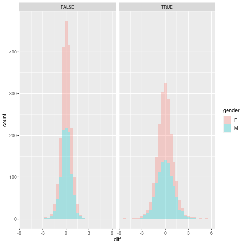
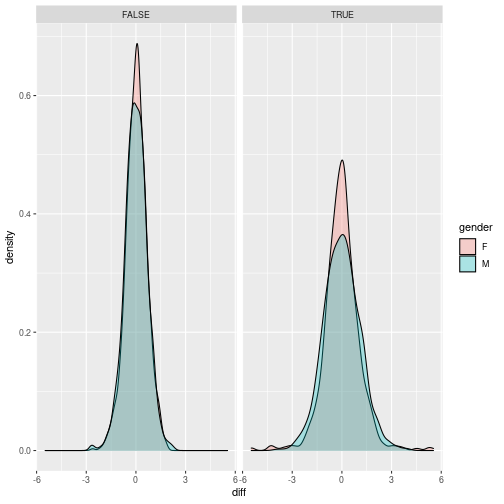

## The excercise

Some of your patients suffer from "fakeria disisea", treated data contains genes of patients that have been drinking specially designed drug. Some of these patients claim they are cured and they can feel changes in their gene
regualtion ^^
Can you guess which patients are the *cured* ones?

> ## Challenge 1
>
> Download and load in R those files: [data](https://raw.githubusercontent.com/r-crash-course/r-crash-course.github.io/master/_episodes_rmd/data/genes_cases.csv) and [metadata](https://raw.githubusercontent.com/r-crash-course/r-crash-course.github.io/master/_episodes_rmd/data/cases_metadata.csv).
> Notice that `data` has named rows!
>
> > ## Solution to Challenge 1
> > 
> > ~~~
> > meta <- read.csv("data/cases_metadata.csv")
> > dt <- read.csv("data/genes_cases.csv")
> > ~~~
> > {: .r}
> {: .solution}
{: .challenge}

> ## Challenge 2
>
> Transform from wide to long the genes_cases data.
> Rename gene column to `genes`.
>
> > ## Solution to Challenge 2
> > 
> > ~~~
> > dt <- dt %>%
> >   gather(key = "ID", value = "value", -X)
> > colnames(dt)[1] <- "gene"
> > ~~~
> > {: .r}
> {: .solution}
{: .challenge}

> ## Challenge 3
>
> Merge two tables using id columns.
>
> > ## Solution to Challenge 3
> > 
> > ~~~
> > dt$ID <- sapply(dt$ID, function(x) {
> >   x <- strsplit(x, "_")[[1]]
> >   paste0(x, collapse = "")
> > })
> > dt <- dt %>% full_join(meta, by = c("ID" = "id"))
> > ~~~
> > {: .r}
> {: .solution}
{: .challenge}

> ## Challenge 4
>
> Remove from memory meta table.
>
> > ## Solution to Challenge 4
> > 
> > ~~~
> > rm(meta)
> > ~~~
> > {: .r}
> {: .solution}
{: .challenge}

> ## Challenge 5
>
> Check whether there are any NA in our data.
>
> > ## Solution to Challenge 5
> > 
> > ~~~
> > any(is.na(dt))
> > ~~~
> > {: .r}
> > 
> > 
> > 
> > ~~~
> > [1] TRUE
> > ~~~
> > {: .output}
> {: .solution}
{: .challenge}

> ## Challenge 6
>
> We are going to remove the NA rows. Filter them out. Remove also empty strings!
>
> > ## Solution to Challenge 6
> > 
> > ~~~
> > dt <- na.omit(dt)
> > dt <- dt[dt$gender != "", ]
> > ~~~
> > {: .r}
> {: .solution}
{: .challenge}

> ## Challenge 7
>
> Lets add below40 column to our data and fill it with T/F for those who are below 40 years old.
>
> > ## Solution to Challenge 7
> > 
> > ~~~
> > dt$below40 <- dt$age < 40
> > ~~~
> > {: .r}
> {: .solution}
{: .challenge}

> ## Challenge 8
>
> Can we find in this haystack those genes that have vastly different means between cases and control? Calculate means and standard deviation per gene for control and treated groups, but also split by gender and below40.
>
> > ## Solution to Challenge 8
> > 
> > ~~~
> > avg <- dt %>%
> >   group_by(gene, case, gender, below40) %>%
> >   summarize(avg = mean(value),
> >             sd = sd(value),
> >             .groups = "drop")
> > ~~~
> > {: .r}
> {: .solution}
{: .challenge}

> ## Challenge 9
>
> Now, lets focus on that average and reshape the table, to wider format with columns: gene, control, treated, gender and below40 and compute differences between control and treated lets plot those differences by making histogram and density plots. How to include in the plot information on gender and below40? Save the plots.
> Normally, we would have to do t-test here, but we will not explore any statistics on this course.
>
> > ## Solution to Challenge 9
> > 
> > ~~~
> > avg <- avg %>%
> >   dplyr::select(-sd) %>%
> >   spread(case, avg) %>%
> >   mutate(diff = control - treated)
> > 
> > ggplot(avg, aes(x = diff, fill = gender)) +
> >   geom_histogram(alpha = 0.3) +
> >   facet_grid(. ~ below40)
> > ~~~
> > {: .r}
> > 
> > 
> > 
> > ~~~
> > `stat_bin()` using `bins = 30`. Pick better value with `binwidth`.
> > ~~~
> > {: .output}
> > 
> > 
> > 
> > ~~~
> > ggplot(avg, aes(x = diff, fill = gender)) +
> >   geom_density(alpha = 0.3) +
> >   facet_grid(. ~ below40)
> > ~~~
> > {: .r}
> > 
> > 
> {: .solution}
{: .challenge}

> ## Challenge 10
>
> Lets focus on that group of women under 40. Figure out which genes are those extreme outliers, take top 10 most skewed genes (upregulated and downregulated).
>
> > ## Solution to Challenge 10
> > 
> > ~~~
> > upregulated <- avg %>%
> >   filter(gender == "F", below40) %>%
> >   slice_min(diff, n = 10)
> > 
> > downregulated <- avg %>%
> >   filter(gender == "F", below40) %>%
> >   slice_max(diff, n = 10)
> > ~~~
> > {: .r}
> {: .solution}
{: .challenge}

> ## Challenge 11
>
> Now lets figure out which patient IDs are female and < 40, these patients are `cured` group.
>
> > ## Solution to Challenge 11
> > 
> > ~~~
> > dt %>%
> >   filter(gender == "F", below40) %>%
> >   summarize(ID = unique(ID))
> > ~~~
> > {: .r}
> > 
> > 
> > 
> > ~~~
> >      ID
> > 1   ID7
> > 2  ID14
> > 3  ID20
> > 4  ID26
> > 5  ID33
> > 6  ID39
> > 7  ID51
> > 8  ID53
> > 9  ID54
> > 10 ID55
> > 11 ID71
> > 12 ID75
> > ~~~
> > {: .output}
> {: .solution}
{: .challenge}

> ## Challenge 12
>
> Good job! You are finished! However you can think of some other excercise that could be done using this data. Share your excercise with the teacher.
>
> > ## Solution to Challenge 12
> > 
> > ~~~
> > # Whatever you have came up with!
> > ~~~
> > {: .r}
> {: .solution}
{: .challenge}
, good job.
